<div align="center">

# Areca ERP — Business Management for Arecanut Operations

**Attendance, loans, transactions, and PDF reports — one secure system for daily arecanut business.**

Self-hosted · Firebase-backed · Android-ready (Capacitor)

[](https://nextjs.org)
[](https://react.dev)
[](https://www.typescriptlang.org)
[](https://firebase.google.com)
[](https://capacitorjs.com)
[](#-getting-started-run-it-locally)

</div>

<div align="center">
  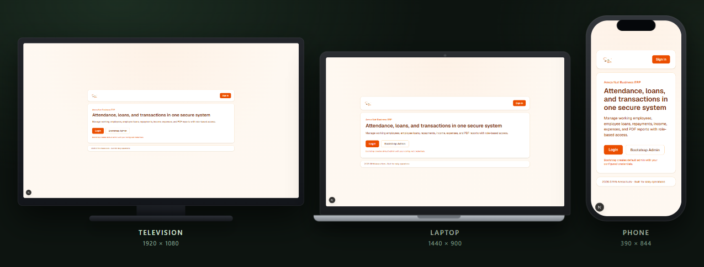
  <p><em>One app · three displays — television, laptop, and phone. Layout adapts to each screen.</em></p>
</div>

---

## Why this exists

Running an arecanut business means juggling workers, day wages, loans, repayments, and cash movement —
often across notebooks, WhatsApp, and spreadsheets. **Areca ERP** puts the daily operations in one place:
employees and attendance, loans tied to the ledger, income/expense tracking, dashboard charts, and PDF
reports — with role-based login so staff only see what they should.

> Built by **Nishanth K R** — *son of a farmer, always a farmer* — for the people who run these books every day.

---

## What you can do

- **Sign in securely** — email or phone login with JWT sessions; roles `ADMIN` and `USER`.
- **Dashboard snapshot** — employees, active loans, income, expense, and profit at a glance.
- **Employees & attendance** — working / with-loan / other statuses; common or custom day wages; salary from attendance.
- **Loans & repayments** — issue and repay loans with automatic business transaction updates.
- **Income & expenses** — track cash movement with category charts and recent activity.
- **PDF reports** — employee and finance reports you can download or back up.
- **Offline-friendly** — queue + manual sync + JSON backup export; Firebase Storage upload for backups.
- **Works on every screen** — phone, laptop, and television layouts; Capacitor config for Android APK.

---

## See it on every display

| Laptop · 1440 × 900 | Phone · 390 × 844 |
| :---: | :---: |
| 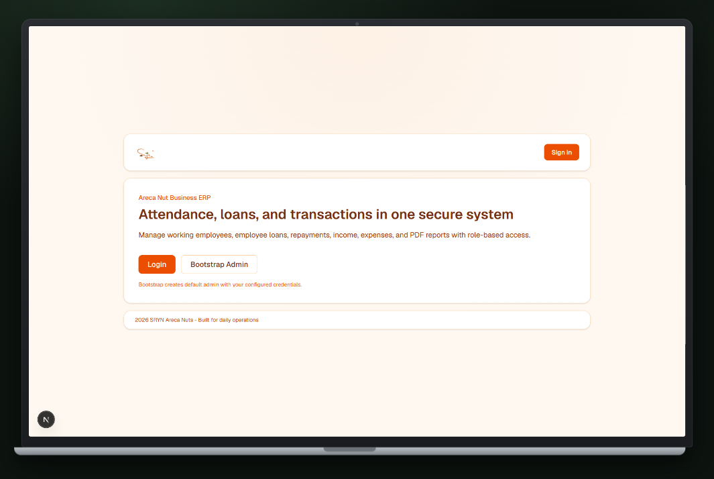 | 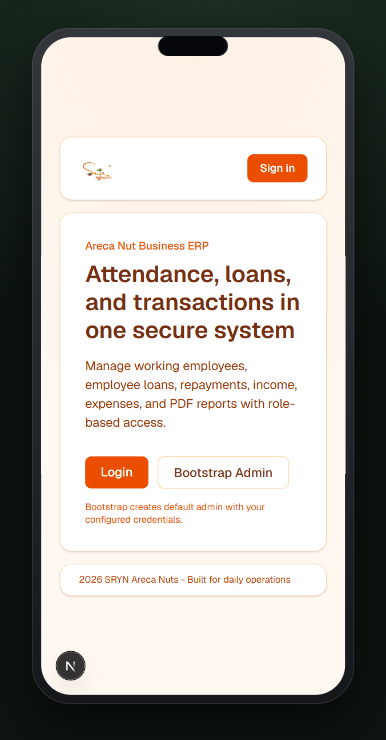 |

<div align="center">

### Television · 1920 × 1080

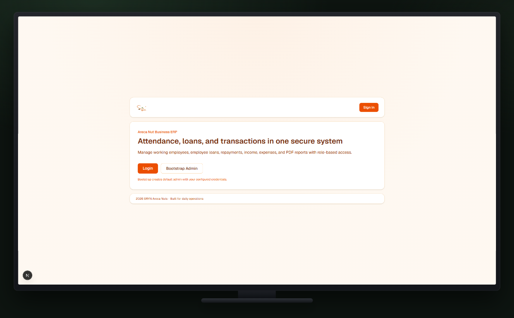

</div>

---

## Every feature, one by one

### 1 · Home & first-time bootstrap

Land on a clear pitch for the ERP, sign in, or create the first admin with **Bootstrap Admin**
(one-time only — safe to leave after that).

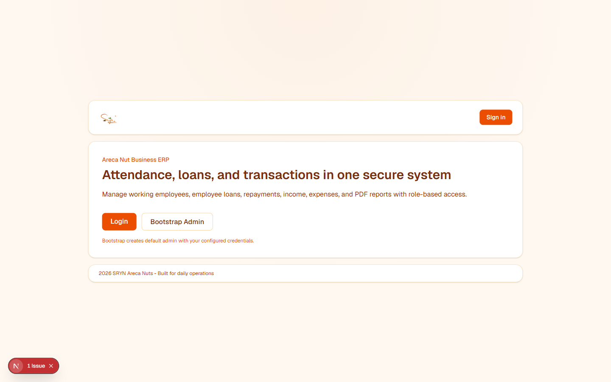

### 2 · Login

Email or phone + password. Sessions are cookie-based JWT; admins reach the full dashboard.

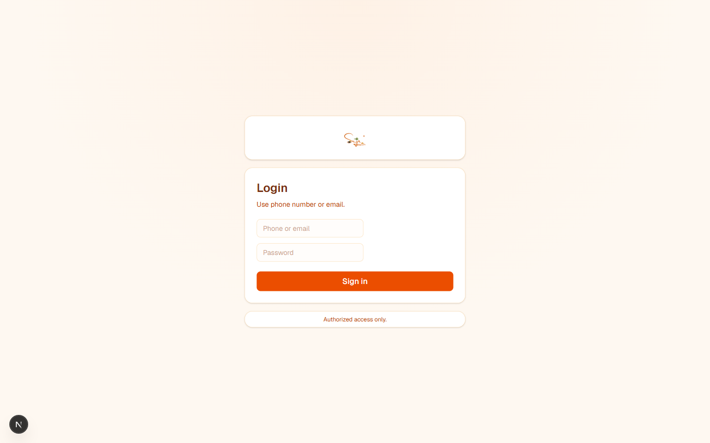

### 3 · Dashboard overview

Business performance snapshot — employee count, active loans, income, expense, profit,
category charts, and recent transactions.

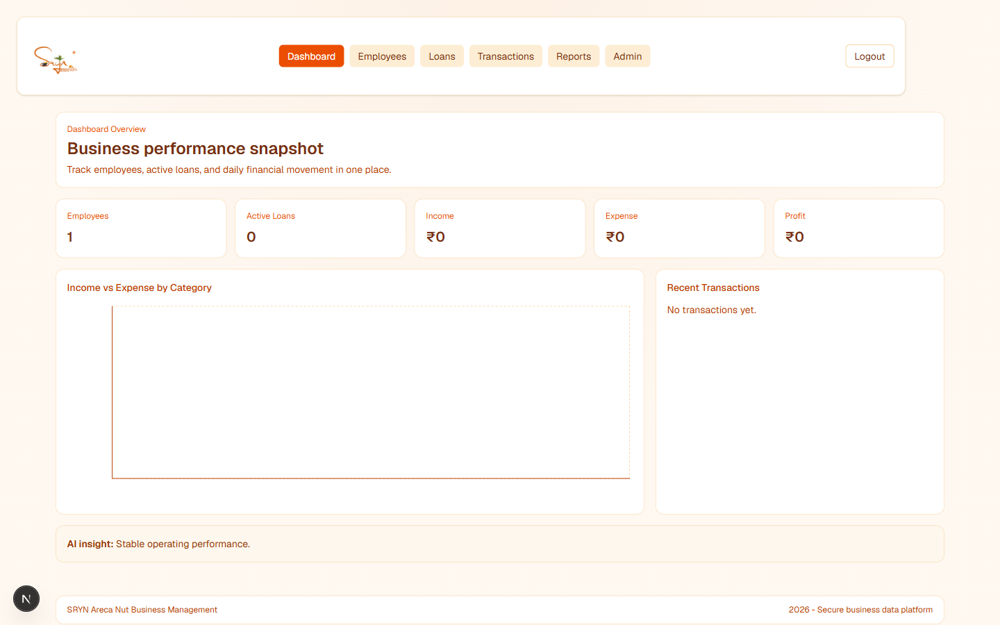

### 4 · Employees

Manage workers by status (`WORKING`, `WITH_LOAN`, `OTHER`), attendance, and wage rules.

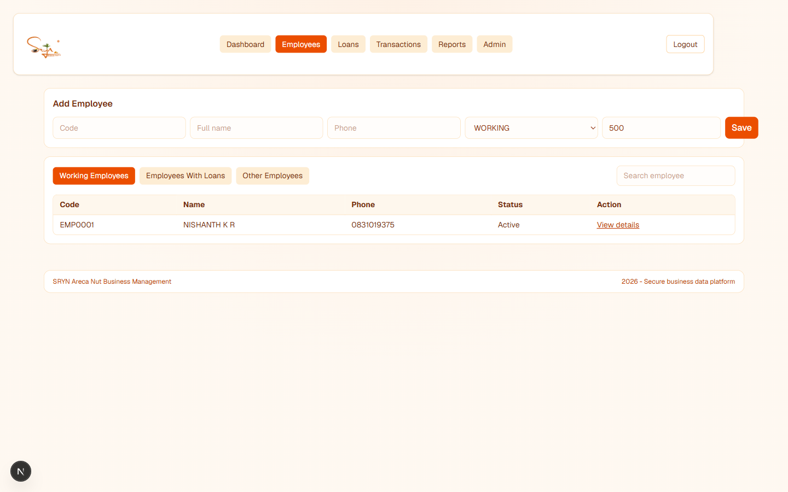

### 5 · Loans

Issue loans and record repayments; the ledger updates automatically with the business transactions.

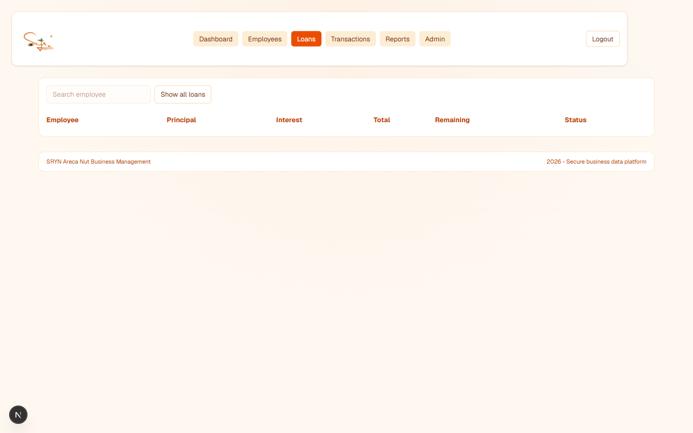

### 6 · Transactions

Income and expense tracking for daily cash movement.

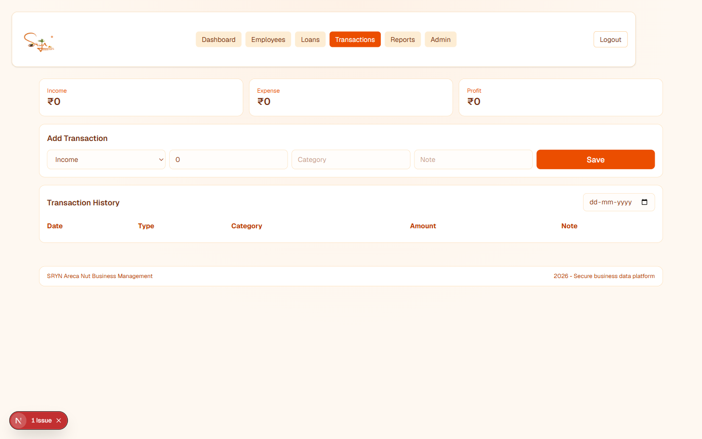

### 7 · Reports

Generate PDF reports for employees and finance; upload backups to Firebase Storage when configured.

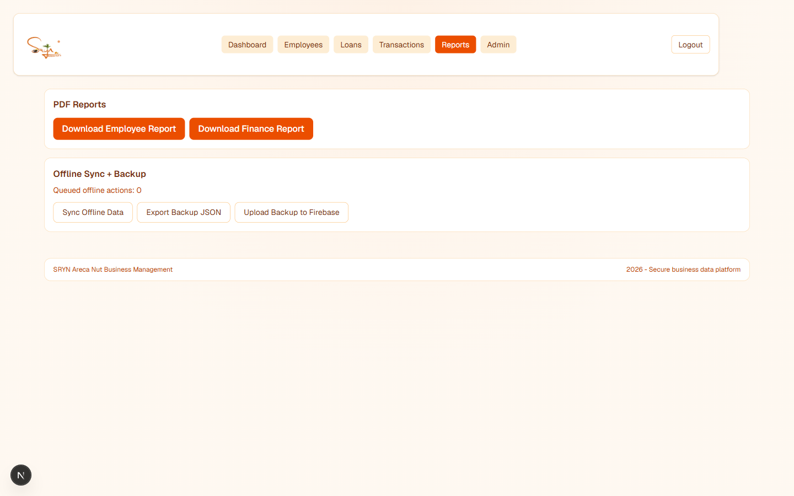

---

## Tech stack

| Layer | Technology |
| --- | --- |
| Frontend | Next.js 16 · React 19 · TypeScript · Tailwind CSS 4 |
| Auth | JWT (jose / jsonwebtoken) · bcrypt · role-based access (`ADMIN` / `USER`) |
| Data | Cloud Firestore · Firebase Admin · Firebase Storage (backups) |
| Charts / PDF | Recharts · jsPDF |
| Mobile | Capacitor 8 (Android) |
| Validation | Zod |

---

## Getting started (run it locally)

```bash
git clone https://github.com/Nishanth1409/Areca-ERP.git
cd Areca-ERP
npm install
cp .env.example .env
```

Fill `.env` with Firebase web config + a service account (`FIREBASE_*`) and a strong `JWT_SECRET`.

1. Create a Firebase project
2. Enable **Firestore** and **Storage**
3. Add a service account key → map `FIREBASE_PROJECT_ID`, `FIREBASE_CLIENT_EMAIL`, `FIREBASE_PRIVATE_KEY` (keep `\n` escaped)

```bash
npm run dev
```

Open **http://localhost:3000**.

### First admin (bootstrap once)

On the home page click **Bootstrap Admin**, or:

```bash
curl -X POST http://localhost:3000/api/bootstrap
```

The response returns the first admin email, phone, and password (defined in
`app/api/bootstrap/route.ts`). Change those values in code **before** the first bootstrap
for any real deployment. Bootstrap returns `409` if an admin already exists.

Then sign in at `/login` and open `/dashboard`.

| Command | What it does |
| --- | --- |
| `npm run dev` | Next.js development server |
| `npm run build` | Production build |
| `npm run start` | Serve production build |
| `npx cap add android` | Add Android platform (after build) |
| `npx cap sync android` | Sync web build into Android |
| `npx cap open android` | Open Android Studio |

### Main routes

| Route | Purpose |
| --- | --- |
| `/` | Home · bootstrap |
| `/login` | Sign in |
| `/dashboard` | Overview |
| `/dashboard/employees` | Employees & attendance |
| `/dashboard/loans` | Loans & repayments |
| `/dashboard/transactions` | Income / expense |
| `/dashboard/reports` | PDF reports & backup |
| `/dashboard/admin` | Admin settings |

### Android (Capacitor)

```bash
npm run build
npx cap add android
npx cap sync android
npx cap open android
```

Build the APK from Android Studio (`Build → Build APK(s)`).

### Deploy

- Host on Vercel (or any Node host that supports Next.js)
- Set the same Firebase + JWT variables in the project environment
- Use **Reports → Upload Backup to Firebase** once Storage is enabled

---

<div align="center">

Made with care by **Nishanth K R** — *son of a farmer, always a farmer.*

[Portfolio](https://nkrportfolio.vercel.app) · [GitHub](https://github.com/Nishanth1409)

</div>
